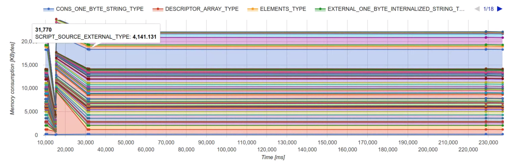

# `Function.prototype.toString()` censorship proposal

A proposal for a new pragma, tentatively `"use no Function.prototype.toString"`, which censors a function's source text to `[native code]`, like other unavailable functions.

This proposal is at stage 1 in the [TC39 process](https://tc39.github.io/process-document/).

## The problem

JavaScript's `Function.prototype.toString()` method reveals the source text originally used to create the function. This causes two main issues:

### Encapsulation leakage

Revealing the source text of a function gives callers unnecessary insight into its implementation details. They can introspect on a function's implementation and react to it, causing what would otherwise likely be non-breaking changes to become breaking ones.

A historical example of this in action is AngularJS's reliance on `f.toString()` to figure out the parameter names of a function. It would then use these as part of its dependency injection framework. This made what was previously a non-breaking change, modifying the name of a parameter, into a breaking one. In particular, it made it impossible to use minification tools in combination with this mode of AngularJS.

Another unnecessary insight gained by `f.toString()` is how a function was created. Most dramatically, it can be used to detect whether an implementation is "native" or not, by looking for the pattern of `[native code]`. This makes high-fidelity polyfilling difficult; indeed, some zealous polyfill libraries have gone as far as to replace `Function.prototype.toString` or introduce an own-property `polyfillFn.toString()` to prevent detection ([1](https://github.com/zloirock/core-js/blob/9f051803760c02b306aae2595621bb7ef698fc29/modules/_redefine.js#L28), [2](https://github.com/paulmillr/es6-shim/blob/8d7aec1403751686dbbd3c4fa13a7bb584a75bf3/es6-shim.js#L139)). It can also be used to detect whether the implementation is done via a `class`, a `function`, an arrow function, a method, etc. It would be preferable if these were mostly-undetectable implementation details, allowing more confidence in refactoring between them.

### Memory usage

Having to store the source text of a function for later lookup causes unnecessary memory usage. Especially on memory-constrained platforms, such as embedded devices or [Android Go phones](https://docs.google.com/presentation/d/1snSOAvzlbHsBaH1nelwf2JQq4KYOd6eWWIIO3fOlajs/edit#slide=id.g26319d7823_6_247), the extra space required for storing source text is quite significant.

Some data on this was gathered in Chrome in [December 2016](https://docs.google.com/document/d/1LlZz8BqxVIaXbTSsYN4ZPgYGwJJpxMq2_sv6RvdRXTI/edit); scroll to the conclusions section, where you can find quotes like:

> renderer's PartitionAlloc (Summary): WTF::StringImpl is clearly the biggest consumer. We confirmed that most of the WTF::StringImpls come from JavaScript source strings.

> To achieve the next massive reduction, it's important to look at the following items: WTF::StringImpl: Most WTF::StringImpls come from JavaScript source strings.

In Februrary 2018, a quick ad-hoc test was performed on Twitter.com (again in Chrome), producing the following graph (source string memory usage is the large blue block):



All that said, at least in some architectures (including V8 and SpiderMonkey), it is not a simple memory win to start censoring `f.toString()`. These engines perform lazy compilation, which requires at least keeping the source text around until the relevant functions have been lazily compiled; it cannot be immediately dropped from memory after parsing. Regardless, we hope that by advancing this proposal we can put the groundwork in place to allow these optimizations to bubble up in priority.

## The solution

The solution is to provide a way to "censor" the output of `Function.prototype.toString()`. In the January 2018 TC39 meeting, it was determined that the solution would involve two separate mechanisms:

* One that applied out of band, especially suited for applications that want to control their memory usage.
* One that is applied in-band with the source text, especially suited for libraries that want to gain encapsulation.

The out-of-band censorship solution would be implemented by the host environment, using the [HostHasSourceTextAvailable](https://tc39.github.io/Function-prototype-toString-revision/#proposal-sec-hosthassourcetextavailable) hook. See [previous revisions of this document](https://github.com/domenic/proposal-function-prototype-tostring-censorship/blob/134802869ce99933973e9b8c19d7fd99a92a352f/README.md#an-external-to-javascript-switch) for more information on that; we do not consider it further here.

This proposal is for the in-band switch. It would be a new pragma, tentatively `"use no Function.prototype.toString"`. Like `"use strict"`, it could be placed at either the source file level or the per-function level.

Similar to the strict pragma, this new pragma would apply "inclusively downward", so that everything within the scope, plus the function itself when in function scope, gets censored. For example:

```js
function foo() {
    const x = () => {};

    const y = () => {
        "use no Function.prototype.toString";
        class Z {
            m() {}
        }
    };
}
```

In this example, `foo` and `x` remain uncensored, while `y`, `Z`, and `Z.prototype.m` are censored.

This proposal draws heavily on the strengths of the existing strict mode pragma:

* It allows easy censorship of an entire source file.
* At the same time, it allows easy bundling together of uncensored and censored code, by using anonymous-function-wrapper blocks.

Notably, this proposal also introduces pragmas into class bodies, where they did not previously exist (since they are always strict).

## Rejected alternatives

### A one-time censorship method

In this alternative, functions get a new method, `f.censor()`, which permanently censors their stringified value. You'd use it like so:

```js
function foo() {
    // ...
}

console.assert(foo.toString().includes("..."));

foo.censor();

console.assert(foo.toString() === "function foo() { [ native code ] }");
```

Note that we do not propose a method that returns a new, censored version because of all the difficulties involved in "cloning" functions: e.g., how would reinstall a method with the correct [[HomeObject]] after creating a new censored version of it?

This alternative seems less good than the pragma:

* It is difficult to en-masse censor many functions. The pragma allows censoring an entire source file at once.
* Censorship is done at runtime, not at parse time, so the implementation needs to store the source text for some interval.
* In general, it makes this a property of the function, and not of the source text, which seems like the wrong level of abstraction, and harder to reason about.

### `delete Function.prototype.toString`

In the past, people have asked if perhaps engines could just detect the pattern of

```js
delete Function.prototype.toString;
```

 early in a source file, and perform appropriate optimizations.

 Unfortunately this does not work in any multi-realm environment:

```js
delete Function.prototype.toString;

function foo() {
    // ...
}

const otherGlobal = frames[0];
console.assert(otherGlobal.Function.prototype.toString.call(foo).includes("..."));
```

It's also a very blunt tool, usable only on the realm level, and thus probably only by application developers. The pragma is targeted at library developers; application developers are better served by the out-of-band solution.

## FAQs

### Should this censor the function name as well?

Some of the same arguments for censorship also apply to a function's `name` property. However, I've left that out of the proposal, because the language already has a mechanism for censoring `name`:

```js
function foo() { }
console.assert(foo.name === "foo");

Object.defineProperty(foo, "name", { value: "" });
console.assert(foo.name === "");
```

As such, I think it's better to leave these two orthogonal.

### Shouldn't this kind of meta-API involve a well-known symbol?

It's tempting, given APIs like `Symbol.isConcatSpreadable` or `Symbol.iterator`, to think that changing the behavior of an object with regard to some language feature should always be done by installing a well-known symbol onto the object.

This does not work very well for our use case. In particular, any kind of symbol flag would be reversible: e.g.

```js
function foo() { /* ... */ }
console.assert(foo.toString.includes("..."));

foo[Symbol.censoredFPToString] = true;
console.assert(!foo.toString.includes("..."));

foo[Symbol.censoredFPToString] = false;
console.assert(foo.toString.includes("...")); // oops
```

This basically makes the censorship toothless, so that you do not gain the encapsulation or memory usage benefits.

You could try to patch around it by saying that only setting it to `true` works, and setting it to `false` or deleting the property does nothing. But that's just strange. We already have a mechanism for changing the state of an object in a non-reversible way: call a method on it. Thus, the `foo.censor()` proposal above (which has its own problems).
